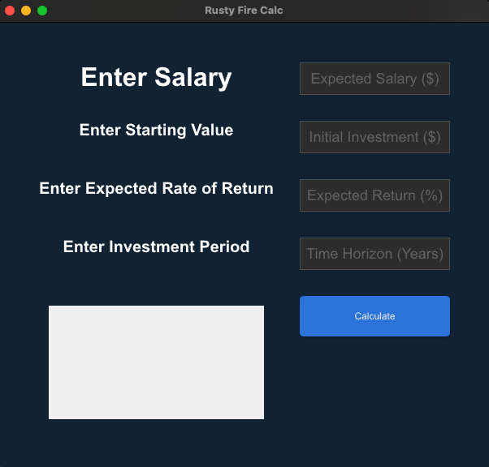

# Rusty Finance

## Description

This is a small desktop app created in Rust, with Slint. 
I made this for budgeting my annual salary to follow a modified version of the 50/30/20 Rule.
When the salary is input, it will calculate what portion of the salary should go in the following categories.

Where I live it's roughly 30% Tax, that is taken into account.  
Then the breakdown is as follows:
- Necessities - 35%
- Wants       - 10.5%
- Investments - 24.5%

 

Including taxes that is how I like to spend 100% of income. ("Doesn't everyone LOVE taxes!!!");

## Installation

`cargo run` to run it.

## Usage

Input your salary, and receieve a calculation of how to budget your income. 
 
Input your Current Investment Value (can be $0). 
Input your expected rate of return (whole integer). 
Input your investment period in years. 

These inputs will then be combined, with the recommended investment amount based off a portion of your annual salary. 

## License

The MIT License

---

## Badges

[comment]: <## Tests> 
